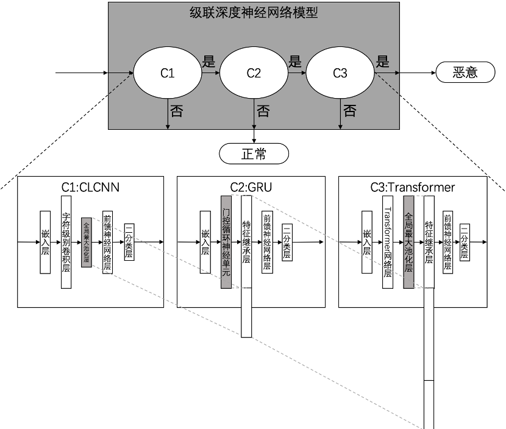

# 该项目方法已受专利保护，论文正在发表中，故不提供源代码，详细方法见已公开专利。
1. 项目背景   
   随着移动互联网的蓬勃发展，应用服务成为服务提供商以线上方式向目标用户提供服务的主流方式。比如，成熟的电子支付、即时通讯以及新兴的网上政务、远程问诊等，这些应用服务使国民生活日益高效便捷。应用服务蓬勃发展的同时，各种数据泄露及针对性安全事件频发。网络攻击者通过构造应用层恶意请求对应用服务进行攻击，以获取应用服务器的控制权及其中的用户数据，进而谋取不正当利益。   
   目前，网络安全解决方案提供商主要采用安全规则匹配技术进行应用层恶意请求检测。安全规则是由安全分析人员通过分析历史攻击行为，提取每种攻击负载中的关键特征，进而构造单条或者多条关联的特征匹配表达式得到的。安全规则匹配方法虽然技术成熟且应用广泛，但是其存在以下3大问题：1.人工参与度高：构建攻击规则极度依赖专家知识，维护及更新的工作量大；2.泛化能力差：对于未知类型的攻击几乎没有检测能力；3.误报漏报率高：检测误报漏报较高的现象普遍存在。   
   近些年来，安全研究人员开始尝试使用机器学习方法进行应用层恶意检测。他们首先通过实验模拟、开源数据调研或者企业合作等方式获取训练数据集，再根据专家知识进行数据分析和特征工程以提取不同特征，然后使用特征集训练并评估机器学习模型，最后使用模型进行应用层恶意请求检测。综合来看，使用机器学习方法进行应用层恶意请求检测，可以有效避免安全规则匹配方法中人为针对每类攻击构建攻击规则的情况，在保证较好的检测及泛化能力的同时，极大地减少人力成本。但是，机器学习方法依然存在手工特征工程以及模型复杂度两方面问题，即机器学习方法需要人为提取原始数据的有效特征以及机器学习模型的学习能力不能适应大规模数据。   
   在最新的研究中，安全研究人员开始尝试使用不同的深度学习方法进行应用层恶意请求检测。深度学习以原始应用层请求信息作为输入，无需人工参与特征定义和特征选择，即可通过层次网络结构自动提取数据中的复杂特征进而构建检测模型。此外，相对于机器学习方法，深度学习方法具有更高的检测准确率、更好的泛化能力及适应大规模数据的优点。   
   伴随着应用层恶意请求检测技术的实现方式从人工规则库，到机器学习，再到深度学习的发展，应用层恶意请求检测中的人工参与度逐步降低，检测准确率及泛化能力逐步提升。但是，3种方法依然没有很好地解决应用层恶意请求检测中普遍存在的误报漏报率高的基本问题。误报（假阳）表示正常请求被错误地判定为恶意请求，致使拦截；漏报（假阴）表示恶意请求被错误地判定为正常请求，致使放行。过高的误报率会拦截大量正常用户请求，影响正常用户的使用体验；过高的漏报率会放行恶意请求，加大网络服务安全风险。因此，误报漏报问题直接影响应用服务的可用性以及安全性，是阻碍基于深度学习的应用层恶意请求检测技术广泛应用的关键。   
   因此，针对现有方法存在的不足，有必要设计一种降低误报漏报率的应用层请求检测方法。
2. 方法图例
    * 基于级联深度神经网络的应用层恶意请求检测的流程示意图
    
    * 级联深度神经网络的模型示意图
    
3. 专利信息
    * 专利名称：基于级联深度神经网络的应用层恶意请求检测方法及系统
    * 申请号：2020100920288 
    * 查询地址：[http://cpquery.sipo.gov.cn/txnIndex.do](http://cpquery.sipo.gov.cn/txnIndex.do)
    * [注]：专利已公开，可使用申请号查询